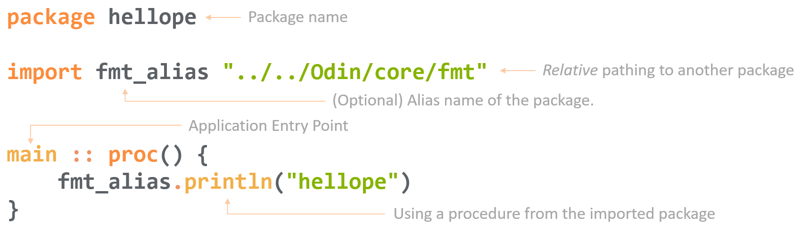

## Chapter II: Program Structure

In this chapter we will look at the structure of a package, how declarations and assignments work, and the rules of scopes. by the end of the chapter We'll have a solid grasp of the structure a program. In the subsequent chapters we'll flesh out the types and control flow, making that program capable of doing useful work.

### Attributes, Directives, Tags and Build-Directives

I would prefer to wait until later to introduce modifiers, but it seems best to immediately prime you to them so that they can be introduced throughout the book as-encountered rather than at the end of the book where they have little context.

Tags, Attributes and Directives are modifiers to existing language keywords and features. The principal reason they exist is to reduce the keyword surface area of the language, keeping the language small and memorable. Some of these are merely syntactic sugar, most have specialty use cases.

#### Attributes

Attributes are used to modify the compilation details of declarations. There are builtin attributes, and custom user-defined attributes. Builtin attributes will be introduced throughout the book, custom attributes are dealt with in **Chapter X: Metaprogramming**. The syntax for attributes is prefixed with an at symbol (`@`) and followed by a single attribute identifier. If the attribute has arguments, it is wrapped in parenthesis (`()`). Multiple attributes also require parenthesis, and are comma seperated. Attributes are always declared in the line above a declaration. The following sample shows applying three separate attributes to a declaration, one having an argument.

```odin
// Multiple Attributes on a Declaration:
@(require, export = false, thread_local)
foo: int
```

#### Directives

Directives modify the behavior of language features. The syntax for directives is hash (`#`) followed by the directive's name. Directives are placed inline, typically before an argument, but there are exceptions which will shown as encountered.

```odin
// Directive reversing the order of transversal of a loop:
#reverse for val in the_slice {
	// ...
}
```

#### Build Tags

Build tags may be found on the first line of a file, preceding the package declaration. They are a line-comment followed by a plus sign (`//+`), followed by the tag's identifier, with no spaces. The following sample build tags make all identifiers private to a package, and states that this file only builds on `linux`.

```odin
//+private, +build linux
package foo
```

### Package Declaration

`package foo`

The package declaration is the first declaration in an Odin file. A package in Odin is a folder in the most literal sense. All .odin files within the same folder must be in the same package ands share the same package _Identifier_. All _Symbols_ are shared across that scope\*. The language's package-centric design results in most Odin projects being far flatter structurally than you might find in other languages.

\* footnote: Identifiers, Symbols, and Scopes covered in **Section X**

#### Design Tradeoff

Historically, there was only the global scope. **todo: do more research here, who did namespaces when, i suspect global+proc scopes was nearly always a thing?** This led to the need to prefix entities with some pseudo-namespace, which is admittedly less than ideal. Scoped namespacing was the obvious solution to this, and has been implemented widely amongst languages. The resulting effect had some unintended side-effects that Odin argues are more detrimental than helpful. The observation is that humans are quite fond of catagorizing and sorting things (applying taxonomies). Few are capable of doing so objectively though, so the tendancy is to have a subjective, arbritrary and _deep_ taxonomy of a program. This often leads to having more abstraction code than actual problem-solving code. Odin elects to partially-return to the pre-namespace days to get away from the knock-on effects caused by it. The cure is postulated to be worse than the disease.

The low-friction path to code-organization in Odin is to have larger files in a relatively flat structure, only splitting into packages when functionality demonstrates it is truly insulated from cross-cutting concerns and warrants the subdivision. Early on, most new users to Odin attempt to bring their habits of small files across many namespaces to Odin, it is far more pleasant to categorize later in the development process than sooner with this language.

As an example of package subdivision, `package png_loader` might be seperate from `package the_game`. The `png_loader` has no relation to a game, it simply loads a png into a buffer structure (that it defines in it's package), and hands it off. The game may then import the `png_loader` and utilize it. If however the `png_loader`'s `load` procedure needed to be given a `Game_Asset` structure and it loads into that asset, now the two packages need to know about each other's types and cannot be directly imported to each other.

If packages need knowledge of shared types (eg A imports B, and B imports A), the strategy to address the cyclic imports would be to make a third package, say `shared`. `A` then imports `shared` and `B` imports `shared`, the cyclic dependancy is resolved. When this is used, the types are only visible via accessing through the shared name or alias, eg `shared.a_member_of_shared`. This can be burdonsome if shared contains a large number of types or procedures. An alias file could be used in each consumer package, which aliases out the shared packages types into the other packages, but this needs to be done for each package using shared. For example:

```odin
package A
import "../shared"
// Redeclare foo to be accessible across the package-scope without the shared prefix
foo :: shared.foo
```

#### Package Requirements

- Must be the first declaration of the file (e.g. not a comment or blank line)
- A package may be named any valid Identifier.
- All `.odin` files within a directory must share the same package name.
- All imports must be acyclic

#### Build Tags:

The first line of the file can contain build directives or a file-wide attribute.

`//+private`: Make all data in the file private to the package
`//+build linux, !windows, darwin`: Restrict compilation of the current file to the Targets listed. An exclaimation (`!`) can be used to logically invert the claim.
`//+build ignore`: prevents this file from bieng compiled

### Import Statements

```
import "./shared"
import "../../Odin/core/fmt"
import la "core:math/linalg"
import "core:math/bits"
```

Import statements are used to bring packages into _scope_ for the _current_ file. A valid Identifier\* may precede the _relative_ path of the package as an alias. In the example above `linalg` is aliased to be `la`. Note that because import statements use relative paths, the default name of an imported package is that of the _final_ folder containing it, _not_ the package's name or the path. In importing the `bits` package above, the default alias is `bits` and _not_ `math/bits` which is not valid syntax. It is convention to keep the package name and folder name the same, but is not required.

\*footnote: Identifiers covered in Section x

#### Collections

The `base`, `core` and `vendor` collections are located adjacent to the compiler''s executable in a normal installation. It would be very inconvienent to attempt to relative-path into the correct `core` package from any arbitrary folder/package on your machine. As such, Odin provides the concept of Collections. A collection most fundamentally may be thought of as a symbolic link (symlink) to a directory. Collection syntax is a collection-name followed by a colon (`:`), the `core:` in the linalg import is accesing the `core` collection. From this point, you're in a directory, and standard pathing applies as if it were a relative path.

User defined collections are produced by a compiler flag `-collection:<name>=<filepath>`. All folders within the named folder become accessible in the same fashion as the `core`.

Import statements are visible to the file-scope.

### Main

The main procedure is the application entrypoint. The main procedure does not accept arguments or return a value. We'll discuss how to do both in **Chapter X**. There can only be one entrypoint in a package. However, packages that have `main` defined may still be imported and used, thier main is not _your_ main. The following annotated program shows a basic hello program, but again using relative pathing to reinforce the idea of directories and symlinks. The `fmt` import will always be `import "core:fmt"` in practice.


