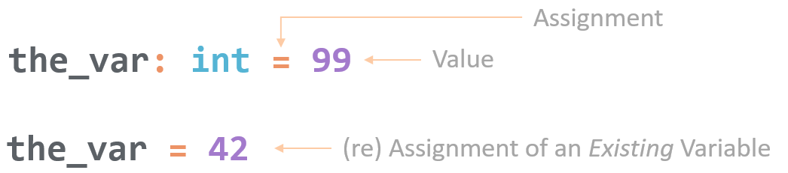
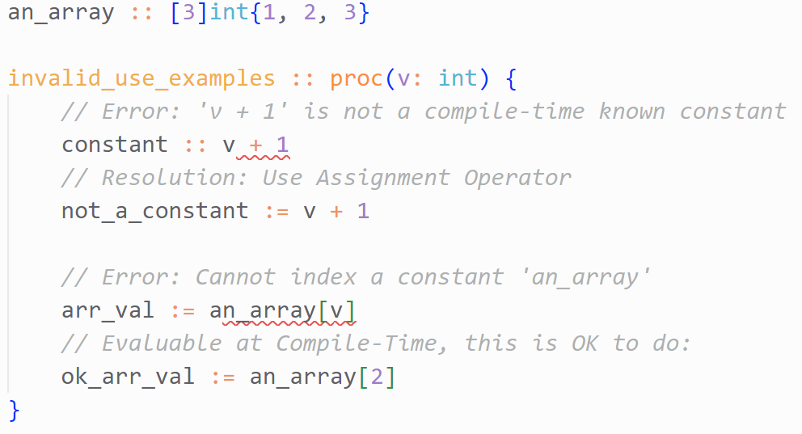

### Declaration and Assignment

Fundamental to programming is the ability to set and manipulate variables. Odin's declaration and assignment syntax places emphasis on the variable names rather than the variable _kind_ (`var foo` / `const foo`) from some languages, or the _type_ as seen in C-like languages (`int foo;`).

#### Declarations

A variable declaration sets an _Identifier_ to have some specific _Type_, and makes it available for the programmer's use for the remainder of the _Scope_ that it was declared in.


In a declaration, the first item listed is the _Identifier_, which may start with an underscore `_`, or any lower/uppercase ASCII letter (`a-z` or `A-Z`). UTF-8 is also permitted from the _Letter_ Categories: Upper, Lower, Titlecase, Modifier, Other. Subsequent characters in an Identifier may also include digits (`0-9`).

Note that the identifier consisting _only_ of a single underscore (`_`) is the _Discard Identifier_, and has special sematics. When used, this identifier acknowledges a value's position, but does not bind it to a variable. This is particularly useful when multiple return values from procedures are used, examples of its use are provided in **ChX: Procedures**.

The colon (`:`) following the Identifier is the _Declaration Operator_; it signifies that the preceding Identifier is to be declared as a _Symbol_ in the current _Scope_.

When a Declaration is not followed by subsequent operators, it must include a _Type_. The type is either a primative, structured or procedure-type. Types are covered in detail in **Chapters 3, 4, and 7**.

**Note:** When variables are declared, even if not explicitly assigned, they are initialized to the appropriate Zero-Value, see **Ch X,Sect Y**.

Odin permits multiple declaration to be comma seperated, as long as all of the identifiers share the same declared type. `a, b: int` is the same as `a:int` and `b:int`.

#### Assignments



For variables that have been declared, they may also be assigned to a concrete value. The equals sign (`=`) is used for assignment. When a value has been previously declared and/or assigned, it may be re-assigned.

When _not_ in the package-scope, a variable may be explicitly not initialized by using the `---` operator. This specifies to the complier _Do not zero-init this memory_. Typically this is done for performance; the values will be written later, therefore zero-initialization is a wasted operation.

Example usage: `foo: int = ---`

Odin supports multiple assignments with the requirement being the number of Identifiers on the left equaling the number on the right, and positionally each type matches.

```odin
	x, _, z: int = 42, ---, 1

	x, z = z, x

	a:int
	b:bool
	a,b = 11, true
```

In the first example above: `x` is set to 42, the second argument is the Discard Identifier, its value was uninitialized memory. Note that it cannot be accessed, `_` is _unspeakable_ as a token to consume. The third value `z` is set to 1. In the following line, x & z have thier values swapped.

The second example shows an integer and a boolean working in the same way, however, note that you _cannot_ swap thier values because the types do not match.

#### Constant Declarations


When a second colon operator is used after a declaration, that type is declared to be a compile-time constant. Note that these are _not_ constant global variables as you might first believe, but more akin to `#define` constants in C. If they are declared, but never used, they are pruned away. Where they are used, they are inserted at the usage site as a literal value.

They may be evaluated at compile-time, but the calculations must be knowable at compile-time. For example, you may want a constant for 4-megabytes `FOUR_MEGABYTES :: 4 * (1 << 20)`. This will, at any site using it, insert the literal `4,194,304`.

Two common misconceptions with constant declarations are attempts to access into a constant declared array, and attempting to use them as immutuble variables. The following example uses a procedure, which we'll cover in detail in **Chapter X**, but the important detail is that the parameter `v` is knowable only at runtime.



#### Type Inference

Many types may be known by looking at the right hand side of an assignment or declaration. When this is the case, Odin will permit you to omit the type between the declaration and assignment operators. Odins Type system is covered in more detail in **Chapter X**.


#### Shadowing

Redeclaration of a variable is defined as Shadowing. Odin does not permit shadowing within the current scope, but it does permit shadowing inside of a child scope. The `-vet-shadowing` compiler flag catches these sometimes, the conditions it will permit are: **TODO- SHADOW RULES**

```odin
	a := 3
	// a:=7 <-- cannot do this, it is in the same scope
	{
		// Valid Shadow:
		a := 5
	}
```

**TODO: FILE PROPOSAL FOR #SHADOW+BAN-SHADOWING AGHHH I HATE SHADOWING PTSD AGHH**

### Attributes

The following attributes apply to declarations in general, which includes variables, **?** and procedures.

`@private`: prevents an Identifier from being exported outside of the current package. This is a shortend version of `@(private="package")`.

`@(private="file")`: prevents access to the Identifier from outside the current file.

`//+private`: file-wide build tag that applies @private to every entity.

```odin
//+private
package foo
```

`@require`: Ensures the declaration ends up in the emitted code. Unused declarations will be pruned if not tagged with `@require`.

`@export`: Exports the entity's Symbol for consumption in dynamic linking. Long-form: `@(export=true/false)`.

`@static`: Marks a local variable (not in the pcakage/file scopes) to be static; it does not lose state, even after scope-exit. Functionally equivalent to a `static` local variable in C.

`@thread_local`: Marks a variable as thread-local storage (TLS). This means that each thread has its own independent instance. Useful when you need per-thread data that should not be shared across different threads in a multi-threaded environment. Similar to `thread_local` in C.

### Directives

None relevant to declarations & assignments.
